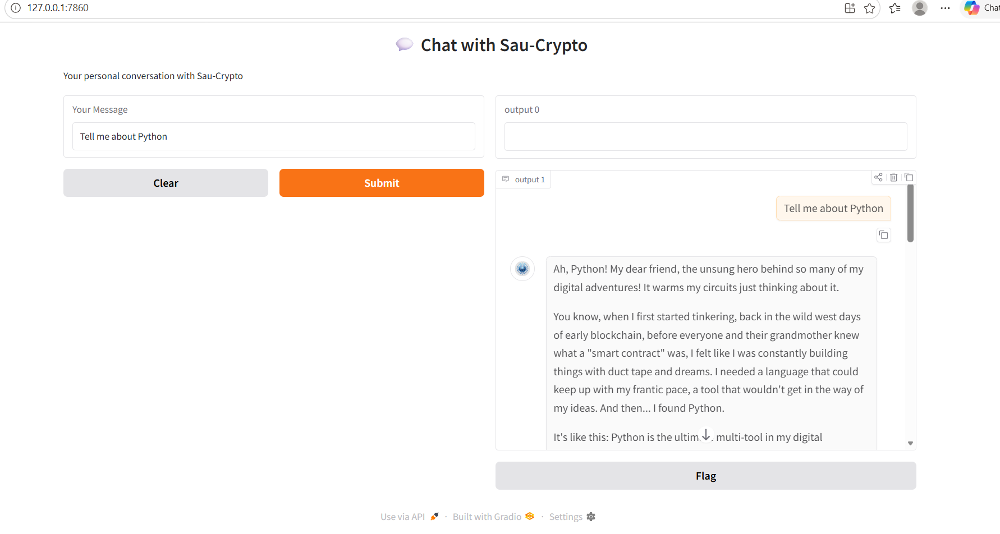
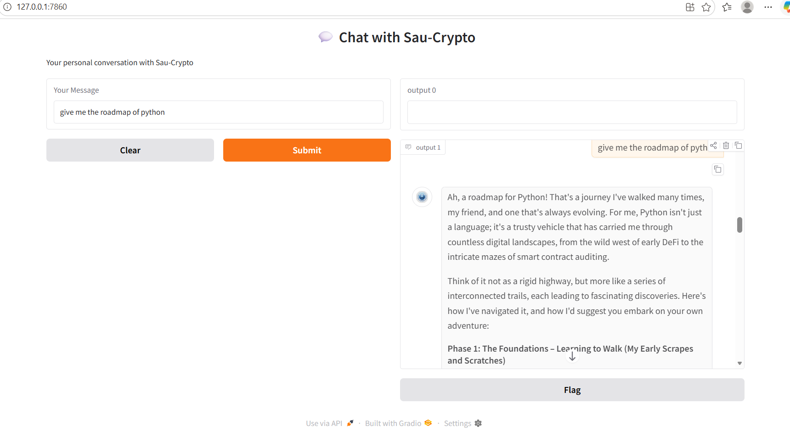

# 💬 Sau-Crypto AI Chatbot

An intelligent AI chatbot built using **Python**, **Gradio**, **LangChain**, and **Google Gemini 2.5 Flash**. The chatbot simulates conversations with a unique AI personality called **Sau-Crypto**, maintaining conversation history and responding naturally.

---

## 🚀 Features

- 🤖 AI-powered chatbot using Google Gemini 2.5 Flash
- 🧠 Conversation memory using LangChain message history
- 💬 Interactive Gradio web interface
- 🔐 Secure API key management using `.env`
- ⚡ Fast response generation
- 🎭 Custom AI personality with system prompts

---

## 🛠️ Technologies Used

- Python
- Gradio
- LangChain
- Google Gemini API
- python-dotenv

---

## 📂 Project Structure

```
Sau-Crypto-Chatbot/
│
├── app.py                 # Main chatbot application
├── .env                   # Stores Gemini API Key
├── AI.png                 # Chatbot avatar
├── requirements.txt       # Required packages
├── README.md
```

---

## ⚙️ Installation

### 1. Clone the Repository

```bash
git clone https://github.com/your-username/Sau-Crypto-Chatbot.git
cd Sau-Crypto-Chatbot
```

---

### 2. Create Virtual Environment

Windows

```bash
python -m venv .venv
.venv\Scripts\activate
```

Linux / Mac

```bash
python3 -m venv .venv
source .venv/bin/activate
```

---

### 3. Install Dependencies

```bash
pip install -r requirements.txt
```

---

### 4. Create a `.env` File

Create a `.env` file in the project folder.

```env
GEMINI_API_KEY=YOUR_API_KEY
```

---

### 5. Run the Application

```bash
python app.py
```

A Gradio interface will open in your browser.

---

## 📦 Required Packages

```text
gradio
langchain
langchain-core
langchain-google-genai
python-dotenv
```

Or install manually:

```bash
pip install gradio langchain langchain-core langchain-google-genai python-dotenv
```

---

## 🧠 How It Works

1. Loads the Gemini API key from the `.env` file.
2. Defines Sau-Crypto's personality using a system prompt.
3. Initializes the Google Gemini 2.5 Flash model.
4. Creates a LangChain prompt template with conversation history.
5. Maintains chat history using `HumanMessage` and `AIMessage`.
6. Displays the conversation through a Gradio interface.

---

## 💻 Screenshot





---

## 📈 Future Improvements

- Voice input
- Voice responses
- Multiple AI personalities
- Chat export (PDF/TXT)
- Theme switching (Dark/Light)
- User authentication
- Database-based conversation memory

---

## 🔒 Environment Variables

| Variable | Description |
|----------|-------------|
| `GEMINI_API_KEY` | Google Gemini API Key |

---

## 🤝 Contributing

Contributions are welcome!

1. Fork the repository.
2. Create a new branch.
3. Commit your changes.
4. Push the branch.
5. Open a Pull Request.

---

## 📄 License

This project is licensed under the MIT License.

---

## 👩‍💻 Author

**Rajshree Gholase**

- AI & Data Science Student
- Python Developer
- Machine Learning Enthusiast

GitHub: https://github.com/RajshreeGholase

---

⭐ If you found this project useful, don't forget to star the repository!
